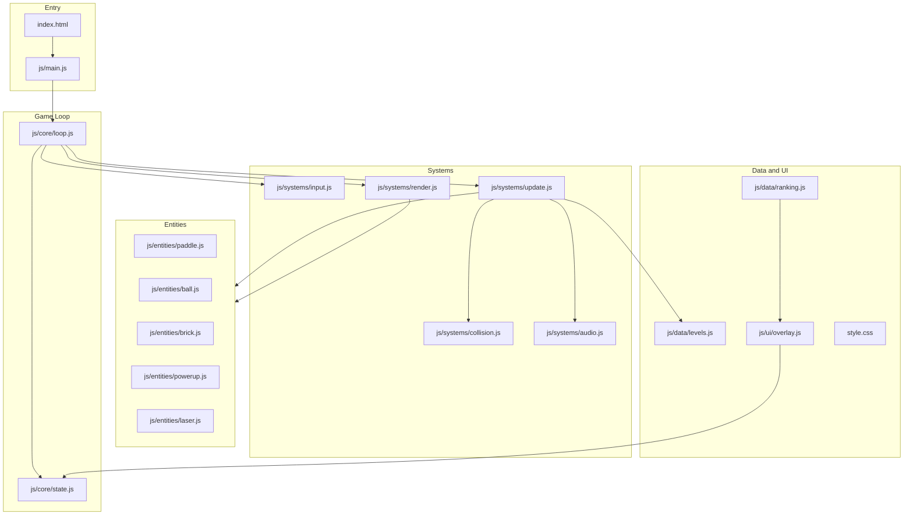
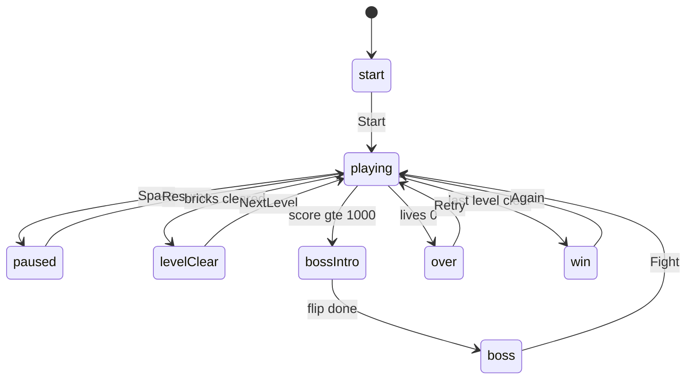

# 벽돌 깨기 게임 — 아키텍처·구현 단계 사양서

## 1. 전제 (`.cursorrules`)

- 역할: 아키텍처 설계를 중요시하는 시니어 프론트엔드 게임 개발
- 프로세스: Plan → 서면 승인(Approve) → 모듈 단위 구현 (일괄 통짜 금지)
- 스택: HTML5 Canvas + Vanilla JavaScript(ES6+), 외부 라이브러리 없음
- 기존 구현은 `backup01/`에 보관·무시 대상이며, **신규는 모듈 구조로 재설계**
- 사용자 승인 전에는 실제 파일 수정을 시작하지 않음

---

## 2. 목표 아키텍처

단일 파일에 로직을 몰아넣지 않고, **상태 / 입력 / 물리·충돌 / 엔티티 / 렌더 / 오디오 / UI** 를 분리한다.



### 2.1 디렉터리 구조 (목표)

```
ex04blockGame/
  SPEC.md                 # 본 사양서
  index.html
  style.css
  js/
    main.js               # 부트스트랩, 모듈 연결
    core/
      constants.js        # 캔버스 크기, 속도, 점수 임계값 등
      state.js            # 단일 게임 상태 객체 + mode 전이
      loop.js             # requestAnimationFrame 루프
    entities/
      paddle.js
      ball.js
      brick.js
      powerup.js
      laser.js
      particles.js
    systems/
      input.js
      update.js
      collision.js
      render.js
      audio.js
    data/
      levels.js           # 레벨 레이아웃 / 벽돌 패턴
      ranking.js          # localStorage 랭킹
    ui/
      overlay.js          # start/pause/clear/boss/over/win
```

### 2.2 모듈 책임

| 모듈 | 책임 |
|------|------|
| `main.js` | Canvas 획득, 모듈 초기화, 루프 시작 |
| `constants.js` | 캔버스 크기, 기본 공 속도, 최대 레벨, 보스 점수(1000), 속도 배율 프리셋 |
| `state.js` | 단일 `state` 객체, mode 전이 API |
| `loop.js` | `requestAnimationFrame` — input → update → render 고정 순서 |
| `input.js` | 키보드/마우스/터치 → `state.input` |
| `update.js` | 엔티티 이동, 타이머, mode 관련 진행 |
| `collision.js` | 벽·패들·벽돌·레이저 충돌 판정 및 결과 반영 |
| `render.js` | Canvas 그리기(배경, 엔티티, 인게임 배지) |
| `audio.js` | Web Audio BGM/SFX, 뮤트 |
| `paddle.js` / `ball.js` / `brick.js` 등 | 엔티티 생성·갱신(순수에 가깝게) |
| `levels.js` | 레벨 그리드, 벽돌 색/패턴/아이템 벽돌 배치 |
| `ranking.js` | localStorage TOP 랭킹 읽기/쓰기 |
| `overlay.js` | DOM 오버레이 표시(mode 변경 시에만) |

### 2.3 핵심 설계 원칙

| 원칙 | 내용 |
|------|------|
| 단일 상태 | `state` 한곳에서 mode, score, lives, entities 배열 관리 |
| 순수에 가까운 엔티티 | 생성/갱신 함수만 제공, DOM·오디오 직접 호출 최소화 |
| 시스템 분리 | 입력 → 갱신(물리/충돌/아이템) → 렌더 순서를 루프가 고정 |
| mode 머신 | `start \| playing \| paused \| levelClear \| bossIntro \| boss \| over \| win` |
| 상수 분리 | 속도 배율, 보스 점수(1000), 레벨 수 등은 `constants.js` |
| ES modules | `type="module"`로 통일 (IIFE 네임스페이스 혼용 금지) |

### 2.4 상태·모드 전이



### 2.5 데이터 흐름 (1프레임)

1. `input`이 키/마우스/터치를 `state.input`에 반영
2. `update`가 paddle/ball/brick/power/laser/보스 이동·타이머 처리
3. `collision`이 벽·패들·벽돌·레이저 충돌 결과로 HP/점수/아이템 드롭
4. mode 전이·랭킹·오디오 트리거
5. `render`가 배경·엔티티·HUD 배지만 Canvas에 그림
6. Overlay UI는 mode 변경 시에만 DOM 갱신

---

## 3. Step 1 ~ Step 3 구현 체크리스트

### Step 1 — 기반 골격 (플레이 가능한 최소 루프)

목표: 다크 캔버스에서 패들·공·벽 반사까지.

- [x] `index.html` + `style.css` 기본 레이아웃(HUD 자리, 캔버스, 시작 오버레이)
- [x] `js/main.js`에서 Canvas 컨텍스트 획득 및 모듈 연결
- [x] `constants.js` / `state.js` / `loop.js` 작성
- [x] `paddle.js` + `ball.js` + `input.js` (좌우/마우스)
- [x] 벽·패들 충돌 반사 (`collision.js` 초안)
- [x] SPACE/클릭으로 공 발사, 낙하 시 리셋(생명 차감은 Step 2)
- [x] `render.js`로 배경·패들·공 그리기
- [x] **수락 기준:** 브라우저에서 패들 조작·공 발사·벽 반사가 안정적으로 동작

> Step 1 구현 완료 (모듈 분리). ES modules이므로 `index.html`은 로컬 서버로 열어 실행한다.

### Step 2 — 코어 게임플레이

목표: 벽돌·점수·목숨·레벨·오버레이로 “게임”이 성립.

- [x] `brick.js` + `levels.js` (레벨 레이아웃, 무지개 색, 패턴 필드)
- [x] 벽돌 충돌·파괴·점수·콤보
- [x] 목숨(lives), 게임오버 / 레벨 클리어 / 다음 레벨
- [x] `overlay.js` (start, pause, levelClear, over, win)
- [x] 레벨 진행(최대 레벨 상수화), HUD 점수·레벨·목숨 연동
- [x] 단단한 벽돌(2타) 지원
- [x] **수락 기준:** 1레벨 클리어 → 다음 레벨, 목숨 소진 시 게임오버

> Step 2 구현 완료. Step 3(아이템·보스·랭킹·사운드)는 별도 승인 후 진행.

### Step 3 — 확장 시스템 (아이템·보스·랭킹·사운드)

목표: 재미/완성도 시스템. Step 1·2 API를 깨지 않고 시스템 추가.

- [x] 아이템 엔티티(`powerup.js`): WIDE(패들 확장), MULTI(공 3개), LASER, SLOW, LIFE
- [x] 특정 벽돌 파괴 시 지정 아이템 드롭 + 일반 랜덤 드롭
- [x] 레이저(`laser.js`) + 입력(Z/클릭) + 타이머
- [x] 점수 1000 돌파 시 화면 전환(플립) 후 대왕 보스 벽돌 보너스 스테이지
- [x] `ranking.js` (localStorage TOP 랭킹, 이름 저장 UI)
- [x] `audio.js` (Web Audio BGM + SFX, 뮤트 토글)
- [x] 속도 배율 토글(0.5× / 1× / 1.5× / 2×) — 공·패들·아이템·레이저·보스에 일괄 적용
- [x] 벽돌 디자인 패턴(stripe/diamond/dots 등) 렌더
- [x] **수락 기준:** 아이템·레이저·보스·랭킹·사운드·속도 토글이 Step 2 흐름을 깨지 않고 동작

> **개발 완료.** Step 1~3 모두 구현됨. 실행: 로컬 서버에서 `index.html` 오픈.

---

## 4. 비기능·품질 기준

- 외부 라이브러리/빌드 도구 없이 정적 파일만으로 브라우저 실행
- 모듈은 ES modules(`type="module"`)로 통일
- 매 Step 종료 시 이전 Step 수락 기준 회귀 확인 후 다음 Step 승인 요청
- `backup01/`은 참고용으로만 사용, 신규 코드에 복사·붙여넣기식 통짜 이식 금지

---

## 5. 작업 경계

| 포함 (본 사양서 단계) | 제외 |
|----------------------|------|
| 아키텍처·체크리스트 문서화 | 게임 코드 작성 |
| `SPEC.md` 저장 | Step 1 구현 시작(별도 승인 필요) |

**Step 1 구현은 본 사양서와 별도의 명시적 승인 후에만 시작한다.**
