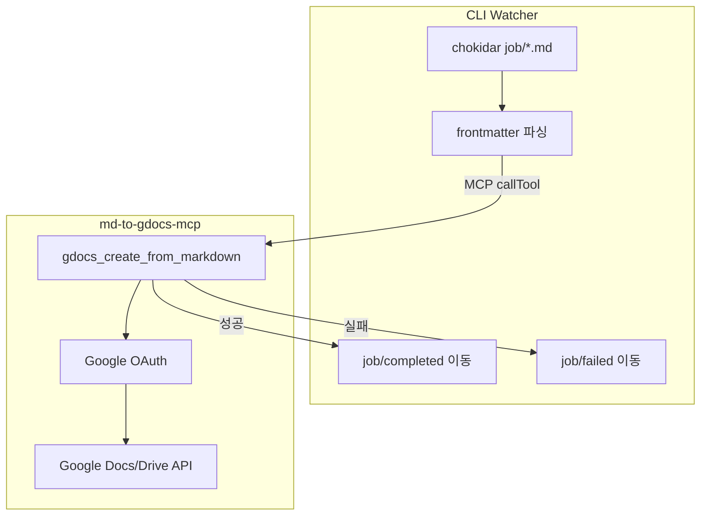

# SPEC: MD → Google Docs 자동 등록

## 1. 목적

Markdown 파일을 Google Docs에 자동 등록하는 시스템. `job/` 폴더에 `.md` 파일을 넣으면 MCP Server를 통해 Google Docs로 변환·등록하고, 완료 후 `job/completed/`로 이동한다.

## 2. 확정 요구사항

| 항목 | 결정 |
|------|------|
| 아키텍처 | 분리 구조 — MCP Server(Google Docs) + CLI Watcher(job 감시) |
| Doc 처리 | 항상 신규 Google Doc 생성 |
| Doc 제목 | frontmatter `title` (없으면 파일명 fallback) |
| 실행 방식 | 자동 감시(watch) + 수동 CLI(process) |
| 실패 처리 | `job/failed/`로 이동 + `.error.log` 기록 |
| 공유 | frontmatter로 파일별 지정, 없으면 env 기본값 |

## 3. 아키텍처



## 4. 디렉터리 구조

```
ex06mdToGoogleDocs/
├── docs/SPEC-md-to-gdocs.md
├── md-to-gdocs-mcp/          # MCP Server
├── cli/                      # Job Watcher (MCP Client)
├── job/                      # 처리 대기 MD
│   ├── completed/
│   └── failed/
├── .cursor/mcp.json
└── .env.example
```

## 5. MCP Server (`md-to-gdocs-mcp`)

### Cursor MCP 설정

```json
{
  "mcpServers": {
    "md-to-gdocs": {
      "command": "node",
      "args": [
        "md-to-gdocs-mcp/node_modules/tsx/dist/cli.mjs",
        "md-to-gdocs-mcp/src/index.ts"
      ],
      "env": {
        "GOOGLE_OAUTH_CLIENT_PATH": "credentials.json",
        "GOOGLE_OAUTH_TOKEN_PATH": "token.json",
        "GOOGLE_DRIVE_FOLDER_ID": "드라이브 폴더 ID",
        "GOOGLE_SHARE_WITH": "",
        "GOOGLE_SHARE_ROLE": "reader",
        "JOB_DIR": "job"
      }
    }
  }
}
```

### 환경 변수

| 변수 | 사용 주체 | 설명 |
|------|-----------|------|
| `GOOGLE_OAUTH_CLIENT_PATH` | MCP Server | OAuth 클라이언트 JSON |
| `GOOGLE_OAUTH_TOKEN_PATH` | MCP Server | refresh token 파일 |
| `GOOGLE_DRIVE_FOLDER_ID` | MCP Server | Doc 생성 폴더 ID |
| `GOOGLE_SHARE_WITH` | MCP Server | 기본 공유 대상 (빈값 = 미공유) |
| `GOOGLE_SHARE_ROLE` | MCP Server | reader / writer / commenter |
| `JOB_DIR` | CLI Watcher | job 폴더 경로 |

### MCP Tools

**`gdocs_create_from_markdown`** — Markdown으로 새 Google Doc 생성

입력: `title`, `markdown`, `folderId?`, `shareWith?`, `shareRole?`

출력: `documentId`, `documentUrl`, `title`

**`gdocs_auth`** — OAuth 초기 인증 (token.json 생성)

## 6. CLI Watcher

| 모드 | 명령 | 동작 |
|------|------|------|
| watch | `npm run watch` | `job/` 자동 감시 — `.md` 복사/추가 시 변환 |
| once | `npm run process -- --file job/foo.md` | 단일 파일 |
| all | `npm run process -- --all` | job/ 전체 일괄 |

### Watcher 동작 (`npm run watch`)

`job/`에 Markdown 파일을 복사·저장하면 자동으로 Google Docs 변환을 시작한다.

| 항목 | 내용 |
|------|------|
| 감시 대상 | `job/*.md` (루트만, `completed/`·`failed/` 제외) |
| 구현 | chokidar — 디렉터리 `depth: 0` 감시 (Windows glob 누락 방지) |
| 쓰기 완료 대기 | `awaitWriteFinish` (stability 800ms) — 복사 중 조기 읽기 방지 |
| 디바운스 | 동일 파일 add/change 300ms 병합 |
| 시작 시 | 이미 `job/`에 있는 `.md`를 스캔해 즉시 처리 |
| 이벤트 | `add`(신규/복사), `change`(수정 저장) |
| 종료 | `Ctrl+C` (SIGINT) → MCP 연결 종료 |

사용 예:

```bash
# 터미널에서 watcher 기동
npm run watch

# 다른 창/탐색기에서 job/ 에 .md 복사
# → 자동 변환 → job/completed/ 또는 job/failed/
```

### 처리 파이프라인

1. `job/`에서 `.md` 감지 (completed/, failed/ 제외)
2. in-memory 잠금으로 중복 실행 방지
3. gray-matter로 frontmatter 파싱
4. MCP Client → `gdocs_create_from_markdown` 호출
5. 성공 → `job/completed/` 이동
6. 실패 → `job/failed/` 이동 + `.error.log`

### frontmatter 스키마

```yaml
---
title: 주간 보고서
shareWith: user@example.com
shareRole: reader
---
```

## 7. 구현 Phase

1. Phase 0: OAuth & MCP Skeleton — 완료
2. Phase 1: MVP 변환 (heading, bold, list) — 완료
3. Phase 2: Job Pipeline (watch, completed/failed) — 완료
4. Phase 3: GFM (table, code block)
5. Phase 4: 운영 문서

## 8. 추후 검토

- 동일 title Doc 중복 생성 허용 (현재: 허용)
- 로컬 이미지 처리
- 재시도 정책 (현재: 즉시 failed 이동)
