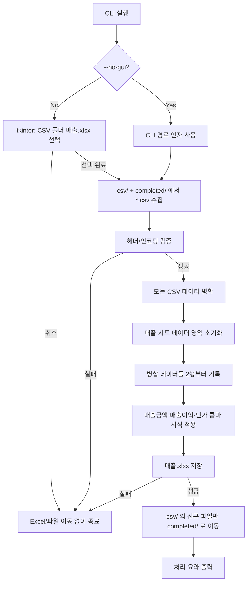

# A01 CSV → 매출.xlsx 적재 사양서

## 개요

`resData/csv/` 폴더의 CSV 파일을 읽어 `resData/매출.xlsx`의 **매출** 시트에 출력한다.  
읽기가 완료된 CSV 파일은 `resData/csv/completed/` 폴더로 이동한다.  
프로그램 언어는 **Python**을 사용한다.

---

## 확인된 사항

| 항목 | 내용 |
|------|------|
| CSV 위치 | `resData/csv/` — 36개 파일 (`{영업소}_{YYYY-MM}.csv`) |
| CSV 구조 | 16열, 헤더: `매출일, 영업소, 영업담당, 기간, 전표번호, 상품코드, 상품명, 대분류, 중분류, 소분류, 거래처코드, 거래처명, 매출수량, 매출금액, 매출이익, 단가` (UTF-8) |
| Excel 대상 | `resData/매출.xlsx` — **매출** 시트만 수정 |
| 매출 시트 현재 상태 | 1행 헤더 + 데이터 행 (적재 후 2442행) |
| CSV 총 데이터 | 2442행 (시트 placeholder 행 수와 일치) |

### 사용자 확인 사항

| 질문 | 선택 |
|------|------|
| 매출 시트 데이터 적재 방식 | **replace_all** — 기존 데이터를 모두 지우고, 이번에 처리한 CSV만 다시 채움 |
| replace_all 범위 | **pending_plus_completed** — `csv/` + `completed/`의 모든 CSV를 합쳐 시트 전체를 다시 구성 |
| 프로그램 실행 방식 | **CLI 인자** + **tkinter GUI** — 시작 시 폴더·파일 선택 대화 상자 (기본 경로 `C:\`) |

---

## 동작 정의



### 핵심 규칙

1. **데이터 소스**: `csv_dir` 직하위 `*.csv` + `csv_dir/completed/*.csv` (하위 폴더 재귀 없음)
2. **시트 갱신**: `매출` 시트 1행 헤더 유지 → 2행 이하 기존 값 삭제 → 병합 결과 전체 기록
3. **파일 이동**: Excel 저장 **성공 후에만** `csv_dir` 직하위 CSV를 `csv_dir/completed/`로 이동 (이미 `completed/`에 있는 파일은 재이동하지 않음)
4. **다른 시트**: `거래처`, `서울`, `매출01` 등 **변경하지 않음**
5. **재실행**: `completed`에 쌓인 CSV + `csv`에 새로 넣은 CSV를 합쳐 시트 전체를 다시 구성

---

## CLI 설계

| 인자 | 기본값 | 설명 |
|------|--------|------|
| `--csv-dir` | `resData/csv` | CSV 입력 폴더 |
| `--xlsx-path` | `resData/매출.xlsx` | 대상 Excel 파일 |
| `--sheet-name` | `매출` | 적재 대상 시트명 |
| `--dry-run` | off | Excel 저장·파일 이동 없이 검증/건수만 출력 |
| `--no-gui` | off | GUI 없이 `--csv-dir`·`--xlsx-path` CLI 경로 사용 |

- 기본 실행(GUI): `tkinter.filedialog`로 **CSV 원본 폴더**·**매출.xlsx** 순서 선택
- 대화 상자 초기 경로: **`C:\`**
- 선택 취소 시 오류 메시지 후 종료 (exit code 1)
- `--no-gui` 사용 시 프로젝트 루트 기준 상대 경로 지원
- 경로不存在·시트不存在·CSV 0건 시 명확한 메시지와 non-zero exit code

---

## 구현 파일

| 파일 | 설명 |
|------|------|
| `requirements.txt` | `openpyxl`, `pandas` (Excel 읽기/쓰기 및 CSV 병합) |
| `PA_CSV_to_Excel.py` | CLI 진입점 및 전체 로직 |

`.venv` 가상환경은 `.cursor/rules/executor.mdc` 규칙에 따라 프로젝트 루트에 생성 후 사용한다.

---

## 구현 상세

### 0. GUI 경로 선택 (기본)

- `tkinter.filedialog.askdirectory` — CSV 원본 폴더 (`initialdir=C:\`)
- `tkinter.filedialog.askopenfilename` — 매출.xlsx (`*.xlsx`, `initialdir=C:\`)
- 선택 완료 후 기존 집계·completed 이동 로직 수행
- `--no-gui` 지정 시 CLI 경로만 사용

### 1. CSV 읽기

- `encoding='utf-8-sig'` 로 읽기 (BOM 대응)
- 첫 CSV 헤더를 기준으로 이후 파일 컬럼명·순서 일치 검증
- 불일치 시 파일명과 함께 오류 보고 후 중단
- 병합 순서: 파일명 오름차순 (재현 가능한 고정 순서)

### 2. Excel 쓰기 (openpyxl)

- `load_workbook(xlsx_path)` 로 통째로 열기 → 다른 시트 보존
- `매출` 시트에서 **2행 ~ max_row** 셀 값 삭제 (`delete_rows` 또는 값 clear — 서식/열 너비 유지 목적상 값 clear 우선)
- 2행부터 CSV 행 기록:
  - `매출일`: `YYYY-MM-DD` 날짜 타입
  - `기간`, `전표번호`, `상품코드`, `거래처코드`, `매출수량`, `매출금액`, `매출이익`, `단가`: 숫자 타입
  - 나머지: 문자열
- 금액 컬럼 서식: `매출금액`, `매출이익`, `단가`는 셀 값을 숫자로 유지하고 Excel 숫자 서식 `#,##0`을 적용하여 3자리마다 콤마 표시 (예: 128400 → 128,400)
- 시트 clear 시 금액 컬럼의 기존 서식도 `General`로 초기화
- 저장 전 Excel 파일이 다른 프로그램에서 열려 있으면 `PermissionError` → 사용자에게 파일 닫기 안내

### 3. completed 폴더 처리

- `csv_dir/completed` 없으면 `mkdir(parents=True, exist_ok=True)`
- 이동 대상: `csv_dir/*.csv` 만 (`completed` 내부 파일 제외)
- 동일 파일명이 `completed`에 이미 있으면 **덮어쓰기** (Windows `shutil.move` overwrite) — 충돌 가능성 낮으므로 overwrite로 단순 처리

### 4. 로그/요약

표준 출력 예:

```
읽은 CSV: 36개 (pending 36, completed 0)
적재 행 수: 2442
이동 파일: 36개 → resData/csv/completed/
저장 완료: resData/매출.xlsx
```

---

## 검증 방법

1. `.venv` 생성 후 `pip install -r requirements.txt`
2. `python PA_CSV_to_Excel.py` — GUI로 폴더·파일 선택 후 실행
3. `python PA_CSV_to_Excel.py --no-gui --dry-run` — CLI 경로로 CSV·행 수 확인
4. `python PA_CSV_to_Excel.py --no-gui` — CLI 경로로 실제 적재
5. `매출.xlsx`의 `매출` 시트: 2442행 데이터, 헤더 16열 일치 확인
6. `매출금액`, `매출이익`, `단가` 컬럼에 `#,##0` 콤마 서식 적용 확인
7. `resData/csv/` 비어 있고 36개 파일이 `resData/csv/completed/`에 존재 확인
8. CSV 1개를 `csv/`에 다시 넣고 재실행 → 시트 행 수 = completed 전체 + 신규 1개 합계로 재구성 확인

---

## 주의사항

- Excel 파일을 Excel에서 **열어 둔 상태**에서는 저장 실패할 수 있음
- `replace_all` 방식이므로, `csv/` + `completed/`에 없는 데이터는 시트에서 사라짐
- `매출01` 시트는 요청 범위 밖이므로 수정하지 않음

---

## Tasks

- [x] 1.0 프로젝트 환경 구성
  - [x] 1.1 프로젝트 루트에 `.venv` 생성
  - [x] 1.2 `requirements.txt` 작성 (`openpyxl`, `pandas`)
  - [x] 1.3 가상환경에 패키지 설치
- [x] 2.0 CLI·GUI
  - [x] 2.1 `PA_CSV_to_Excel.py` CLI 인자 파싱 (`--csv-dir`, `--xlsx-path`, `--sheet-name`, `--dry-run`, `--no-gui`)
  - [x] 2.2 tkinter GUI 경로 선택 (CSV 폴더·매출.xlsx, initialdir=C:\)
- [x] 3.0 CSV 처리
  - [x] 3.1 `csv/` + `completed/` CSV 수집
  - [x] 3.2 `utf-8-sig` 읽기 및 헤더 검증
  - [x] 3.3 파일명 오름차순 정렬 후 병합
- [x] 4.0 Excel 적재
  - [x] 4.1 `매출` 시트 데이터 영역 초기화
  - [x] 4.2 병합 결과 2행부터 기록 (타입 변환 포함)
  - [x] 4.3 `매출금액`, `매출이익`, `단가`에 `#,##0` 콤마 서식 적용
  - [x] 4.4 다른 시트 보존 후 저장
- [x] 5.0 파일 이동 및 출력
  - [x] 5.1 저장 성공 시 `csv/` 신규 파일만 `completed/`로 이동
  - [x] 5.2 처리 요약 출력
- [x] 6.0 검증
  - [x] 6.1 `--dry-run`으로 CSV·행 수 확인
  - [x] 6.2 실제 실행으로 2442행 적재·파일 이동 확인
  - [x] 6.3 재실행 시 `pending + completed` 전체 재구성 확인
  - [x] 6.4 금액 컬럼 콤마 서식 적용 확인
