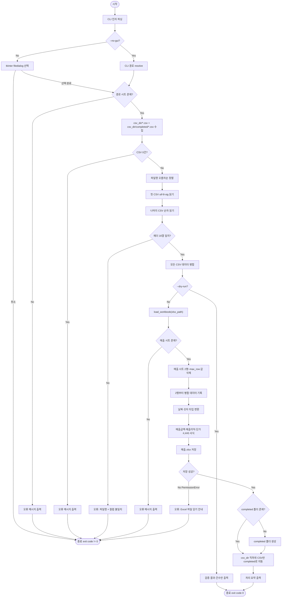
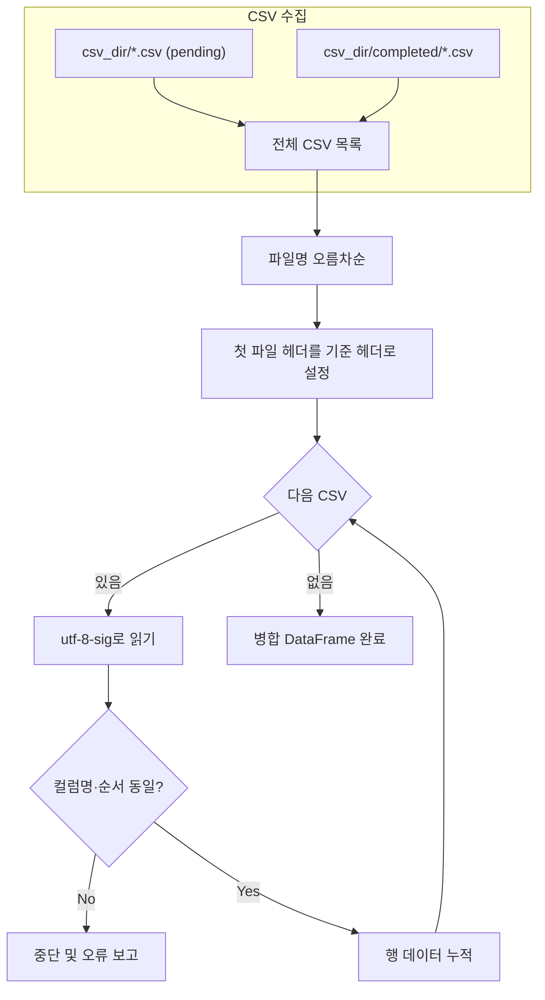
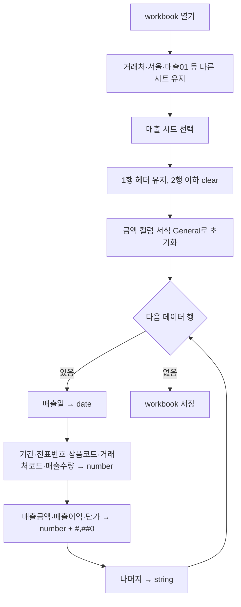
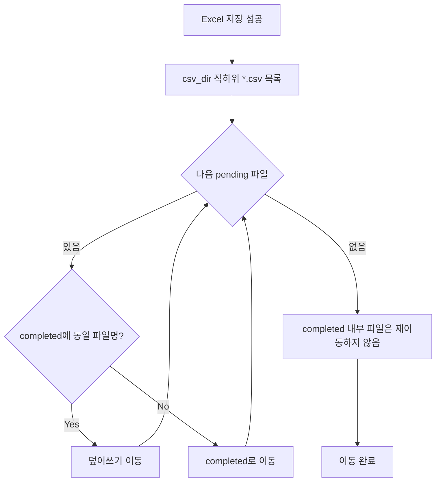

# A02 CSV → 매출.xlsx 적재 Flow Chart

기준 사양: [A01CSV.md](A01CSV.md)

## 개요

`PA_CSV_to_Excel.py` CLI 실행 시 CSV 수집부터 Excel 저장·파일 이동까지의 처리 흐름이다.

## 전체 처리 흐름

## CSV 읽기·병합 상세

## Excel 적재 상세

## 파일 이동 규칙

## replace_all 재실행 흐름

## 범례

| 기호 | 의미 |
|------|------|
| `--dry-run` | Excel 저장·파일 이동 없이 검증만 수행 |
| pending | `csv_dir` 직하위 미처리 CSV |
| completed | `csv_dir/completed/` 이미 처리된 CSV |
| replace_all | 매 실행마다 시트 데이터를 비운 뒤 전체 CSV를 다시 적재 |
| `#,##0` | 매출금액·매출이익·단가 컬럼의 Excel 천 단위 콤마 서식 |
| `--no-gui` | GUI 없이 CLI `--csv-dir`·`--xlsx-path` 사용 |
| `C:\` | GUI 대화 상자 초기 경로 |
