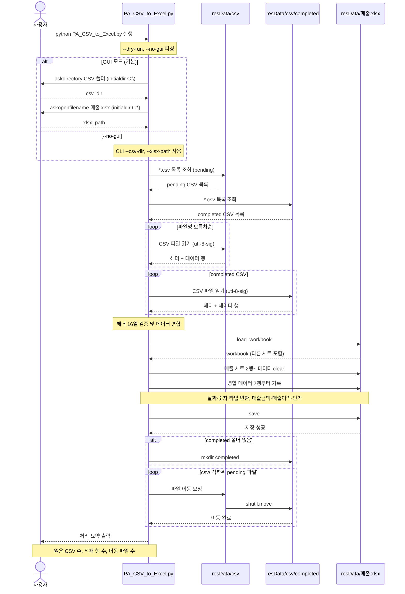
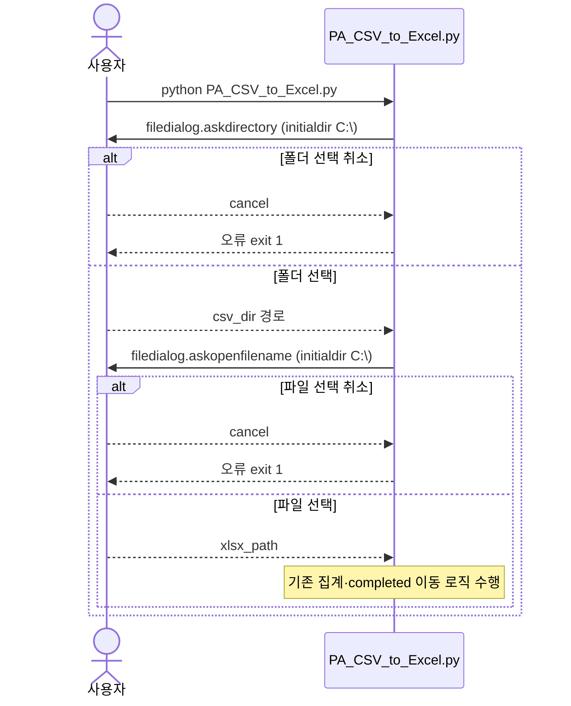
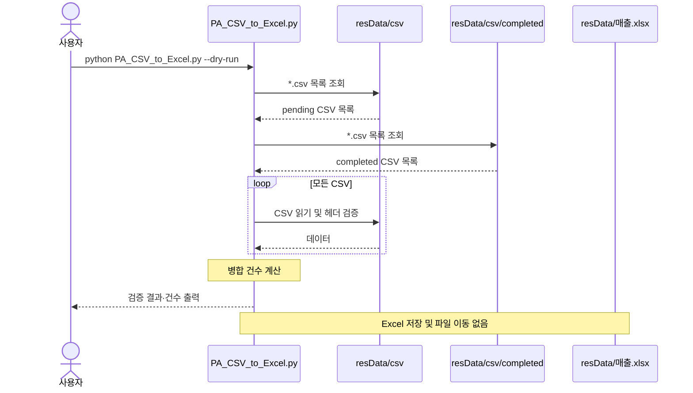
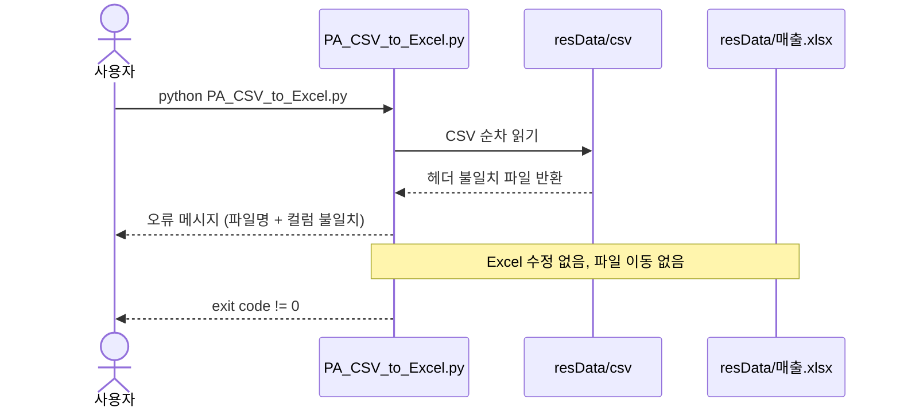
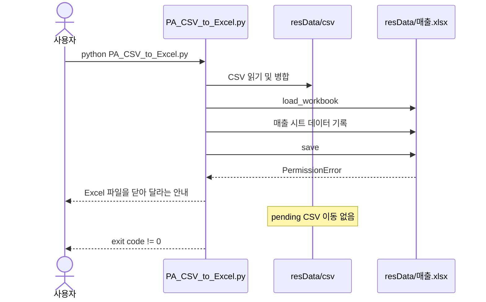
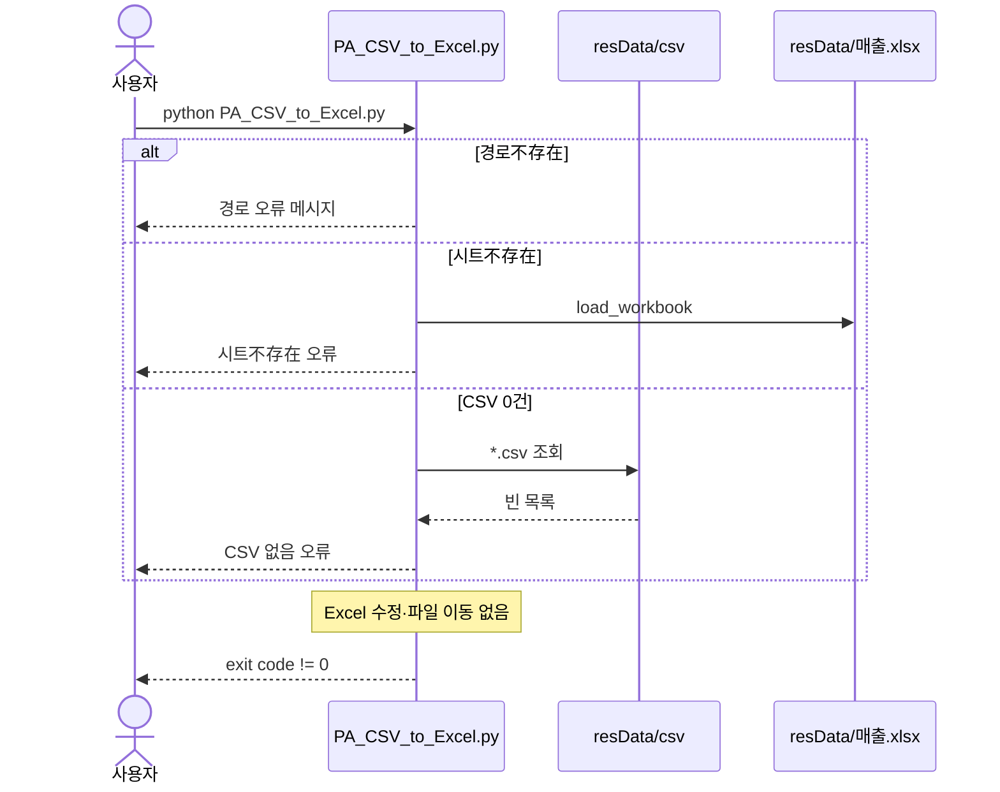
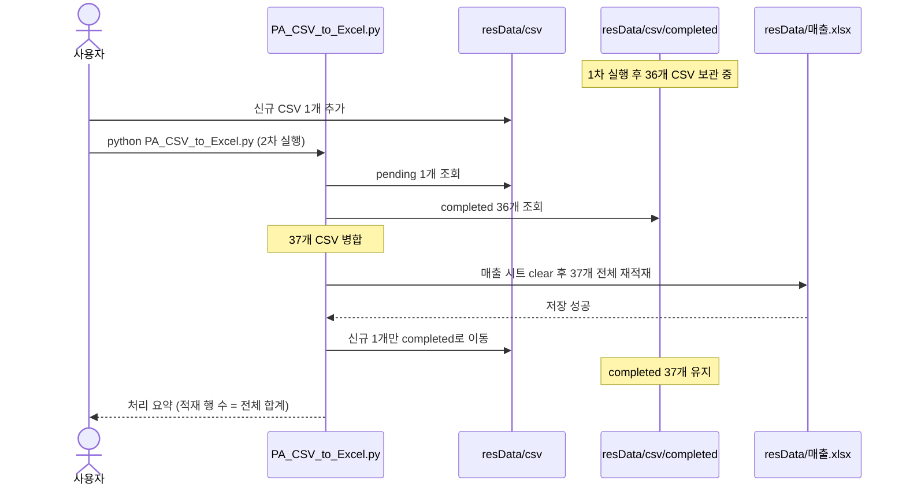

# A03 CSV → 매출.xlsx 적재 Sequence Chart

기준 사양: [A01CSV.md](A01CSV.md)

## 개요

사용자, CLI 프로그램, CSV 폴더, Excel 파일 간의 상호작용 순서를 나타낸다.

## 정상 실행 시퀀스

## GUI 경로 선택 시퀀스

## dry-run 실행 시퀀스

## 오류 처리 시퀀스

### 헤더 불일치

### Excel 저장 실패 (파일 잠금)

### 경로·시트·CSV 없음

## 재실행 시퀀스 (pending + completed)

## 참여자 설명

| 참여자                   | 설명                               |
| --------------------- | -------------------------------- |
| 사용자                   | CLI를 실행하고 결과를 확인                 |
| PA_CSV_to_Excel.py   | CSV 수집·검증·병합, Excel 적재, 금액 서식, 파일 이동 담당 |
| resData/csv           | 미처리(pending) CSV 보관              |
| resData/csv/completed | 처리 완료 CSV 보관                     |
| resData/매출.xlsx       | 매출 시트만 갱신, 다른 시트는 보존             |

