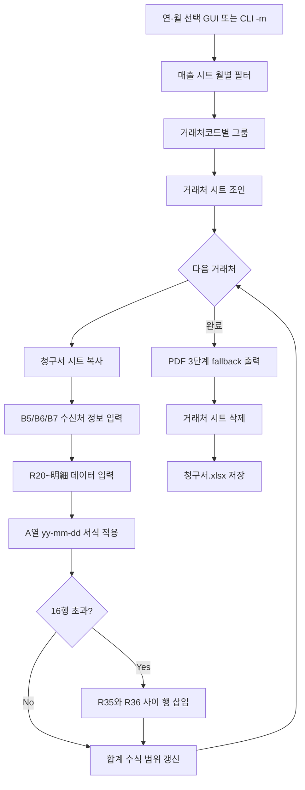

# B01 거래처별 청구서·PDF 생성 사양서

## 개요

임의의 연도·월(`yyyy-mm`)을 지정하여 `매출.xlsx`의 매출 데이터를 거래처별로 추출하고, `청구서.xlsx`의 **청구서** 시트를 복사해 거래처별 청구서 시트를 작성한 뒤 PDF로 출력한다.  
PDF 출력이 완료되면 생성된 거래처별 시트는 삭제한다.

- **OS**: Windows
- **프로그램 언어**: Python
- **프로그램명**: `PB_Make_Bill.py`
- **실행 방식**: **tkinter GUI** (경로·연·월·로그) + **CLI** (`--no-gui`, `-m`)
- **독립 실행 파일**: `WinB_Make_Bill.exe` (PyInstaller, 콘솔 없음)

---

## Excel 구조 조사 결과

### 조사 방법

- `.cursor/mcp.json`에 Excel MCP(`@negokaz/excel-mcp-server`)가 설정되어 있으나, 조사 시점에 MCP 세션 미연결
- 구조 조사는 **openpyxl**로 `resData/매출.xlsx`, `resData/청구서.xlsx`를 읽어 수행
- MCP 연결 시 `excel_describe_sheets`, `excel_read_sheet`로 동일 항목 재검증 가능

### resData/매출.xlsx

| 시트 | 행×열 | 수식 | 본 프로그램 |
|------|-------|------|-------------|
| **매출** | 2443×16 | 없음 | **사용** — 월별 매출 추출 |
| **거래처** | 187×4 | 없음 | **사용** — 수신처 정보 조회 |
| 서울, 광주, 대구, 대전, 부산, 인천 | 32×4 | 없음 | 미사용 |
| 매출01, 거래처01 | — | 없음 | 미사용 |

#### 매출 시트 (1행 헤더)

| 열 | 필드명 | 본 프로그램 용도 |
|----|--------|------------------|
| A | 매출일 | 추출 조건·출력 (날짜) |
| G | 상품명 | 추출·출력 |
| K | 거래처코드 | 그룹핑·거래처 시트 조인 |
| M | 매출수량 | 추출·출력 (수량) |
| P | 단가 | 추출·출력 (단가) |

- 동월 최대 거래처 수: 약 **88건** (2025-07 기준)
- 거래처당 월 최대明細: **27행** (2025-02, 거래처코드 5001) → 템플릿 16행 초과 시 행 삽입 필요

#### 거래처 시트 (1행 헤더)

| 열 | 필드명 | 청구서 입력 위치 |
|----|--------|------------------|
| A | 거래처코드 | 매출 K열과 대조 |
| B | 거래처명 | B7 (B~G 병합) |
| C | 우편번호 | B5 (B~G 병합) |
| D | 주소 | B6 (B~G 병합) |

- 동일 거래처명 **46건** 존재 → 시트명은 거래처명만으로는 충돌 발생

### resData/청구서.xlsx

| 시트 | 행×열 | 병합 셀 | 수식 | 본 프로그램 |
|------|-------|---------|------|-------------|
| **청구서** | 41×9 | 34 | 21 | **복사 원본 템플릿** |
| 청구서 BackUp | 41×9 | 35 | 21 | 미사용 (유지) |
| 청구서(sample) | 56×9 | 40 | 36 | 미사용 (유지) |

#### 청구서 시트 레이아웃

| 영역 | 행 | 설명 |
|------|-----|------|
| 제목 | R2 | `청구서` |
| 수신처·발행자 | R5~R14 | 좌측 B~G: 수신처 입력 / 우측 H~I: 발행자 고정 |
| 요약 | R16~R17 | 이전 청구·입금·매출·소비세·청구액 |
| 明細 헤더 | R19 | 날짜, 상품명, 수량, 단가, 금액, 비고 |
| 明細 데이터 | R20~R35 | **16행** (템플릿) |
| 과세 합계 | R36~R37 | 과세대상액, 소비세 |
| 입금 안내 | R39~R40 | 계좌·비고 |

#### 청구서 시트 사용 중인 수식

```
E17  = H36           (이번달 매출액)
G17  = H37           (소비세)
I17  = =H36+H37      (이번달 청구액 — 원본 등호 중복 오류)
H20~H35 = Fn * Gn    (금액)
H36  = SUM(H20:H35)  (과세대상액 10%)
H37  = INT(H36*0.1)  (과세대상소비세액 10%)
```

- I17 `==` 오류: 구현 시 `=H36+H37`로 보정
- 明細 행 삽입 시 SUM 범위·E17/G17/I17 참조 행 **동적 갱신** 필요

#### 청구서 시트 병합 셀 (수신처·明細)

| 병합 범위 | 용도 |
|-----------|------|
| B5:G5 | 우편번호 입력 |
| B6:G6 | 주소 입력 |
| B7:G7 | 거래처명 입력 |
| B19:E19 | 明細 헤더 상품명 |
| B20:E20 ~ B35:E35 | 明細 상품명 (행별) |
| B36:E36, B37:E37 | 합계 라벨 |

---

## 사용자 확인 사항

| 질문 | 선택 |
|------|------|
| PDF 출력 방식 | **3단계 fallback** — ① Excel COM ② LibreOffice ③ ReportLab 내장 변환 |
| 작업 대상 파일 | **청구서.xlsx**에 임시 시트 생성 → PDF → 거래처 시트만 삭제 (원본 `청구서` 시트 유지) |
| 시트명 중복 처리 | **거래처명_거래처코드_YYMM** (예: `청주식당_1002_2508`) |

---

## 기술 스택

| 구분 | 라이브러리 | 용도 |
|------|-----------|------|
| Excel 읽기/쓰기 | `openpyxl` | 매출 필터, 시트 복사, 셀 입력, 행 삽입, 수식 갱신 |
| 데이터 처리 | `pandas` | 월별·거래처별 매출 그룹핑 |
| PDF 출력 | `pywin32` (`win32com.client`) | 1순위: Excel COM `ExportAsFixedFormat` |
| PDF 출력 (대체) | LibreOffice `soffice --headless` | 2순위: 시트별 단일 xlsx → pdf 변환 |
| PDF 출력 (내장) | `reportlab` | 3순위: Excel/LibreOffice 없이 Windows 기본 한글 폰트로 PDF 생성 |
| CLI | `argparse` | `-m`, 경로 인자, `--no-gui`, `--dry-run` |
| GUI | `tkinter` (`ttk`, `scrolledtext`) | 경로·연·월 선택, 작업 로그, 실행/닫기 |
| 표준 라이브러리 | `pathlib`, `shutil`, `subprocess`, `tempfile`, `re`, `datetime` | 경로·LibreOffice 호출·임시 파일 |

### 실행 환경

- Python 3.x, 프로젝트 루트 `.venv` 가상환경 (`.cursor/rules/executor.mdc`)
- `requirements.txt`: `openpyxl`, `pandas`, `pywin32`, `reportlab`
- **Windows** 필수
- **Microsoft Excel** 또는 **LibreOffice**가 있으면 해당 방식으로 PDF 출력 (Excel 템플릿 레이아웃 유지)
- 둘 다 없어도 **ReportLab 내장 변환**으로 PDF 생성 가능 (레이아웃은 단순화)

### 구현 파일

| 파일 | 설명 |
|------|------|
| `PB_Make_Bill.py` | CLI·GUI 진입점 및 전체 로직 |
| `WinB_Make_Bill.exe` | PyInstaller 독립 실행 파일 (GUI, 콘솔 없음) |
| `requirements.txt` | `openpyxl`, `pandas`, `pywin32`, `reportlab` |

---

## 동작 정의



---

## 기능 요구사항

### 1. 연도·월·경로 지정 (GUI)

- **기본(GUI)**: `launch_bill_gui()` — 아래 항목을 한 화면에서 입력
  - **매출.xlsx** · **청구서.xlsx** — `filedialog.askopenfilename` (기본 경로 `C:\`)
  - **매출 연도** — 입력 상자 (기본값 **2025**)
  - **매출 월** — 드롭다운 `01`~`12`
  - **PDF 저장 폴더** — `filedialog.askdirectory` (기본 경로 `C:\`)
  - **작업 로그** — 스크롤 텍스트 영역에 진행 상황 실시간 표시
  - **실행** — 처리 시작 (완료 후 창 자동 종료 없음)
  - **닫기** — 사용자가 수동 종료
- **CLI**: `--no-gui` 사용 시 `-m` / `--year-month` 및 `--sales-xlsx`, `--invoice-xlsx`, `--pdf-dir` 사용
- 형식 불일치·경로 오류 시 오류 메시지 (GUI: 로그·messagebox, CLI: stderr)

### 2. 매출 데이터 추출

- 대상: `매출.xlsx` → **매출** 시트
- 조건: A열(매출일)의 연·월 = 지정 `yyyy-mm`
- 추출 필드:

| 매출 시트 열 | 필드 | 용도 |
|-------------|------|------|
| A | 매출일 | 明細 날짜 |
| G | 상품명 | 明細 상품명 |
| K | 거래처코드 | 그룹핑·조인 |
| M | 매출수량 | 明細 수량 |
| P | 단가 | 明細 단가 |

- K열 거래처코드 기준으로 그룹핑

### 3. 청구서 시트 복사

- `청구서.xlsx` → **청구서** 시트를 복사하여 거래처별 시트 생성
- 복사 대상: 셀 값, 병합, 수식, 열 너비·행 높이·서식 (openpyxl `copy_worksheet` 또는 동등 처리)

### 4. 거래처별 시트명

- 형식: **`{거래처명}_{거래처코드}_{YYMM}`**
  - `YYMM`: 지정 월의 2자리 연도 + 2자리 월 (예: 2025-08 → `2508`)
  - 예: `청주식당_1002_2508`
- Excel 시트명 제약: `\ / ? * [ ] :` 제거, **31자** 초과 시 truncate
- PDF 파일명: 시트명과 동일 (`{시트명}.pdf`)

### 5. 수신처 정보 입력 (거래처 시트 조인)

- 매출 K열 **거래처코드** = 거래처 A열 **거래처코드** 로 대조
- 입력 위치 (B~G 병합 셀 top-left):

| 거래처 시트 | 필드 | 청구서 셀 |
|------------|------|-----------|
| C열 | 우편번호 | **B5** |
| D열 | 주소 | **B6** |
| B열 | 거래처명 | **B7** |

- 거래처코드 미매칭: **경고 출력 후 해당 거래처 skip** (나머지 계속 처리)

### 6. 明細 데이터 출력 (20행 이후)

- 시작 행: **20행**
- 매출 → 청구서 매핑:

| 매출 | 청구서 | 내용 |
|------|--------|------|
| A열 | A열 | 매출일 (date, 서식 `yy-mm-dd`) |
| G열 | B열 | 상품명 (B~E 병합 유지) |
| M열 | F열 | 수량 (number) |
| P열 | G열 | 단가 (number) |

- H열 금액: `=F{row}*G{row}` 수식 유지
- A열 날짜: Excel 표시 서식 **`yy-mm-dd`** (예: `25-08-31`), 열 너비 최소 **12** (`####` 방지)
- **인쇄 영역**: `print_area = A1:I{tax_row}` — PDF 변환 시 범위 지정
- I열 비고: 비워 둠 (필요 시 추후 확장)

### 7. 明細 행 삽입 (35행 초과 데이터)

- 템플릿 明細: **20~35행 (16행)**
- 明細 건수 > 16이면 **35행과 36행(과세대상액) 사이**에 `(건수 - 16)`행 삽입
- 삽입 후 수식 갱신:

| 셀 | 수식 |
|----|------|
| H20~H{lastDetail} | `=F*G` |
| H{summaryRow} | `=SUM(H20:H{lastDetail})` |
| H{summaryRow+1} | `=INT(H{summaryRow}*0.1)` |
| E17 | `=H{summaryRow}` |
| G17 | `=H{summaryRow+1}` |
| I17 | `=H{summaryRow}+H{summaryRow+1}` |

- 사용하지 않는 明細 행(데이터 미입력): 값·수식 clear

### 8. PDF 출력

- 출력 위치: GUI/CLI에서 지정한 **PDF 저장 폴더** (없으면 생성)
- 거래처별 생성 시트 1장 = PDF 1파일 (`{시트명}.pdf`)
- **3단계 fallback** (`export_pdfs`) — 앞 단계 실패 시 다음 방식 자동 시도, 로그에 기록

#### 8.1 1순위: Excel COM (`export_pdfs_with_excel_com`)

- `pythoncom.CoInitialize()` / `CoUninitialize()` — GUI 스레드 COM 초기화
- PyInstaller exe(`frozen`)에서는 `Dispatch`, 개발 환경에서는 `EnsureDispatch` 우선
- `Workbooks.Open(절대경로, ReadOnly=True)` → 시트별 `ExportAsFixedFormat(Type=0, ...)`
- 변환 후 **PDF 파일 존재·크기 검증** (`_verify_pdf_file`)

#### 8.2 2순위: LibreOffice (`export_pdfs_with_libreoffice`)

- `soffice.exe` 경로 자동 탐색 (`C:\Program Files\LibreOffice\...`)
- 거래처 시트만 남긴 임시 xlsx 생성 → `--headless --convert-to pdf`
- 시트별 PDF를 지정 `pdf_dir`로 이동·검증

#### 8.3 3순위: ReportLab 내장 변환 (`export_pdfs_with_reportlab`)

- Excel/LibreOffice 없이 동작 (독립 exe 환경 대응)
- `C:\Windows\Fonts\malgun.ttf` 등록 후 한글 PDF 생성
- 청구서 시트에서 B5/B6/B7·明細·합계를 읽어 **단순화된 청구서 레이아웃** PDF 작성
- Excel COM과 **동일한 xlsx 템플릿 레이아웃은 아님** — 데이터·금액은 동일

#### 8.4 PDF 미생성 문제 해결 요약

| 원인 | 해결 |
|------|------|
| Excel 미설치 (`REGDB_E_CLASSNOTREG`) | LibreOffice 또는 ReportLab fallback |
| GUI에서 COM 미초기화 | `pythoncom.CoInitialize()` 추가 |
| PyInstaller exe에서 `EnsureDispatch` 실패 | `frozen` 시 `Dispatch` 사용 |
| Export 후 파일 미생성 | 절대 경로 + `_verify_pdf_file` 검증 |
| PDF 인쇄 범위 | `print_area` 동적 설정 |

- Excel 파일이 다른 프로그램에서 열려 있으면 저장·COM Open 오류 가능

### 9. 시트 삭제 (PDF 완료 후)

- PDF 출력이 **모두 성공**한 뒤, 이번 실행에서 생성한 거래처별 시트 **전부 삭제**
- 유지 시트: `청구서`, `청구서 BackUp`, `청구서(sample)`
- `청구서.xlsx` 저장

### 10. 처리 요약 출력

표준 출력 예:

```
대상 월: 2025-08
거래처: 67건
明細 행: 197건
PDF 출력: 67개 → resData/PDF/
삭제 시트: 67개
저장 완료: resData/청구서.xlsx
```

---

## CLI 설계

| 인자 | 단축 | 기본값 | 설명 |
|------|------|--------|------|
| `--year-month` | `-m` | — | 대상 연월 `yyyy-mm` (`--no-gui` 시 필수) |
| `--no-gui` | | off | GUI 없이 CLI `-m`만 사용 |
| `--sales-xlsx` | | `resData/매출.xlsx` | 매출 Excel 경로 |
| `--invoice-xlsx` | | `resData/청구서.xlsx` | 청구서 Excel 경로 |
| `--pdf-dir` | | `resData/PDF` | PDF 출력 폴더 |
| `--dry-run` | | off | 시트/PDF 생성 없이 대상·건수만 출력 |

- 기본 실행: GUI 연·월 선택 후 처리
- `--no-gui` 사용 시 프로젝트 루트 기준 상대 경로 지원

---

## 비기능 요구사항·제약

| 항목 | 내용 |
|------|------|
| OS | Windows |
| Excel | **선택** — 있으면 1순위 COM PDF (템플릿 레이아웃 유지) |
| LibreOffice | **선택** — 있으면 2순위 PDF |
| ReportLab | **필수(패키지)** — 3순위 내장 PDF, Excel/LO 없을 때 사용 |
| 해당 월 매출 없음 | 거래처 0건 → 정상 종료, PDF 0개 |
| 거래처 skip | 미매칭 코드는 경고 후 skip |
| 백업 | 실행 전 `청구서.xlsx` 백업 권장 |

---

## 검증 방법

1. `.venv` + `pip install -r requirements.txt` (`pywin32`, `reportlab` 포함)
2. `python PB_Make_Bill.py` — GUI에서 경로·연·월 선택 후 실행, 로그창 확인
3. `python PB_Make_Bill.py --no-gui -m 2025-08 --dry-run` — 거래처 67건·明細 197행 확인
4. `python PB_Make_Bill.py --no-gui -m 2025-08 --pdf-dir resData/PDF` — PDF 67개 생성 확인
5. `WinB_Make_Bill.exe` — 독립 exe GUI 실행·PDF 생성 확인
6. PDF A열 날짜가 `yy-mm-dd` 형식으로 표시되는지 확인 (Excel COM 사용 시)
7. 16행 이하 거래처: 수식·합계·PDF 레이아웃 확인
8. 27행 거래처 (`2025-02`, 코드 5001): 행 삽입·SUM 범위·소비세 확인
9. PDF 완료 후 `청구서.xlsx` 시트 3개만 잔존 확인
10. PDF 폴더에 `{거래처명}_{코드}_YYMM.pdf` 파일 존재·크기 > 0 확인

---

## 주의사항

- Excel에서 `청구서.xlsx`를 **열어 둔 상태**에서는 저장·PDF 출력 실패 가능
- 원본 **청구서** 시트는 수정·삭제하지 않음 (복사 원본만 사용)
- 거래처명 중복이 많으므로 시트명에 **거래처코드** 포함 필수
- I17 원본 수식 오류(`==`)는 복사 시 보정
- Excel **미설치** 환경: ReportLab fallback으로 PDF 생성 (로그에 `내장 PDF 변환` 표시)
- Excel COM 실패 시 LibreOffice → ReportLab 순으로 자동 재시도
- ReportLab PDF는 Excel 템플릿과 **레이아웃이 다름** — 금액·明細 데이터는 동일
- PDF 실패 시 생성된 임시 시트가 남을 수 있으므로, 원본 3시트만 남도록 정리 필요

---

## Tasks

- [x] 1.0 프로젝트 환경
  - [x] 1.1 `requirements.txt`에 `pywin32` 추가
  - [x] 1.2 가상환경 패키지 설치
- [x] 2.0 CLI·GUI
  - [x] 2.1 `PB_Make_Bill.py` 인자 파싱 (`-m`, 경로, `--dry-run`, `--no-gui`)
  - [x] 2.2 tkinter GUI (경로·연·월·PDF 폴더·작업 로그·실행/닫기)
  - [x] 2.3 `WinB_Make_Bill.exe` PyInstaller 빌드
- [x] 3.0 매출 추출
  - [x] 3.1 월별 필터 (A열 매출일)
  - [x] 3.2 거래처코드별 그룹핑
  - [x] 3.3 거래처 시트 조인
- [x] 4.0 청구서 시트 생성
  - [x] 4.1 청구서 시트 복사·시트명 sanitize
  - [x] 4.2 B5/B6/B7 수신처 정보 입력
  - [x] 4.3 R20~ 明細 데이터·H열 수식 입력
  - [x] 4.4 16행 초과 시 행 삽입·합계 수식 갱신
  - [x] 4.5 I17 수식 보정
  - [x] 4.6 A열 날짜 `yy-mm-dd` 서식·열 너비 적용
  - [x] 4.7 `print_area` 동적 설정
- [x] 5.0 PDF 출력 (3단계 fallback)
  - [x] 5.1 Excel COM (`CoInitialize`, frozen `Dispatch`, PDF 검증)
  - [x] 5.2 LibreOffice headless 변환
  - [x] 5.3 ReportLab 내장 PDF 변환 (`reportlab`)
- [x] 6.0 정리·출력
  - [x] 6.1 거래처 시트 삭제·원본 3시트 유지
  - [x] 6.2 처리 요약 출력
- [x] 7.0 검증
  - [x] 7.1 dry-run 확인 (2025-08: 67건·197행)
  - [x] 7.2 27행 거래처(5001, 2025-02) 행 삽입·수식 확인
  - [x] 7.3 PDF 일괄 생성 (2025-08: 67개, ReportLab fallback 확인)
