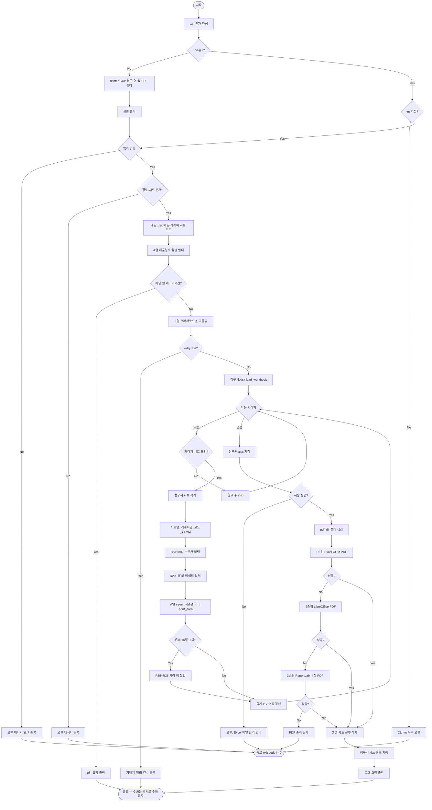
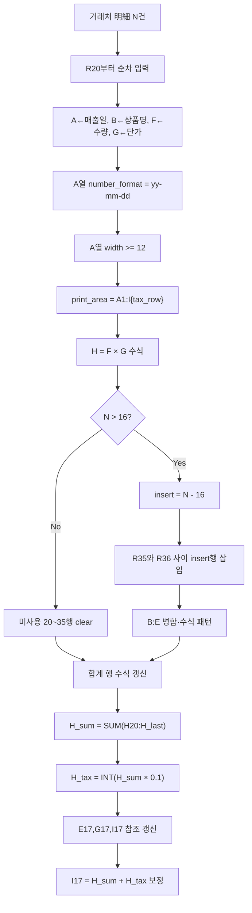
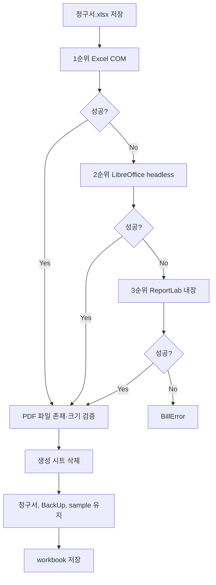
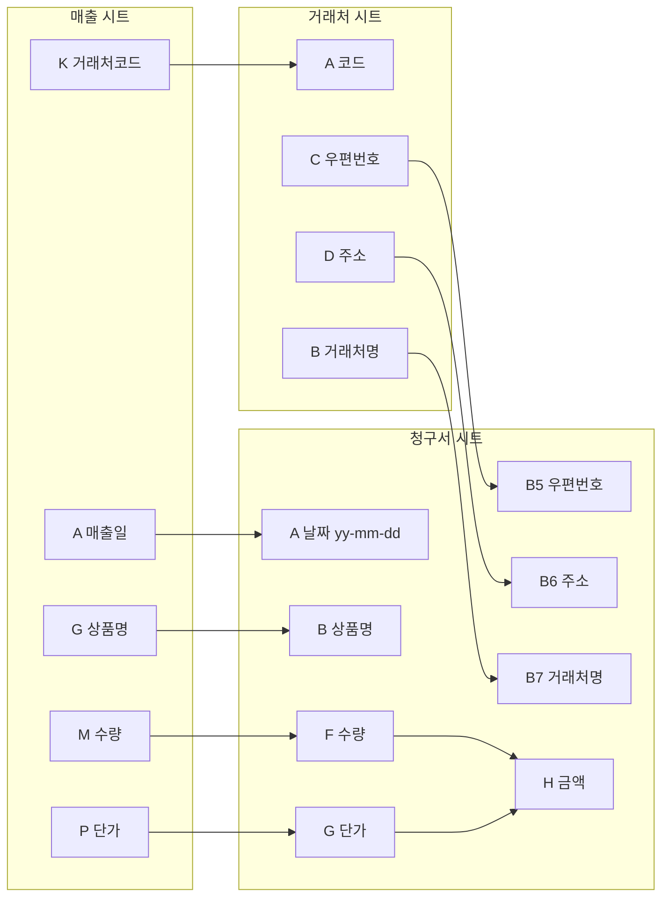

# B02 거래처별 청구서·PDF 생성 Flow Chart

기준 사양: [B01Bill.md](B01Bill.md)

## 개요

`PB_Make_Bill.py` 실행 시 GUI 또는 CLI로 연·월을 지정한 뒤, 월별 매출 추출부터 거래처별 청구서 시트 생성, PDF 출력, 임시 시트 삭제까지의 처리 흐름이다.

## 전체 처리 흐름

## 明細 입력·행 삽입 상세

## PDF 출력·정리 상세 (3단계 fallback)

| 순위 | 함수 | 조건 |
|------|------|------|
| 1 | `export_pdfs_with_excel_com` | Excel 설치, COM 정상 |
| 2 | `export_pdfs_with_libreoffice` | `soffice.exe` 존재 |
| 3 | `export_pdfs_with_reportlab` | `reportlab` + Windows 한글 폰트 |

## 데이터 매핑 요약

## 범례

| 기호 | 의미 |
|------|------|
| `--dry-run` | 시트/PDF 생성 없이 대상·건수만 출력 |
| `--no-gui` | GUI 없이 CLI `-m`만 사용 |
| GUI | 기본 실행 — 경로·연·월·PDF 폴더·작업 로그·실행/닫기 |
| WinB_Make_Bill.exe | PyInstaller 독립 실행 (콘솔 없음) |
| fallback | Excel COM → LibreOffice → ReportLab 순 PDF 시도 |
| YYMM | 2자리 연도+월 (2025-08 → 2508) |
| yy-mm-dd | A열 날짜 표시 (예: 25-08-31) |
| 16행 | 청구서 템플릿 明細 행 (R20~R35) |
| COM | Windows Excel `pywin32` 자동화 |
| skip | 거래처코드 미매칭 시 해당 거래처 제외 |
