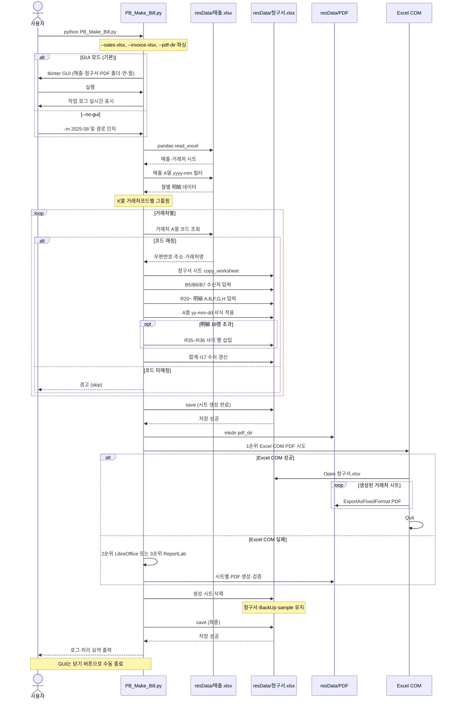
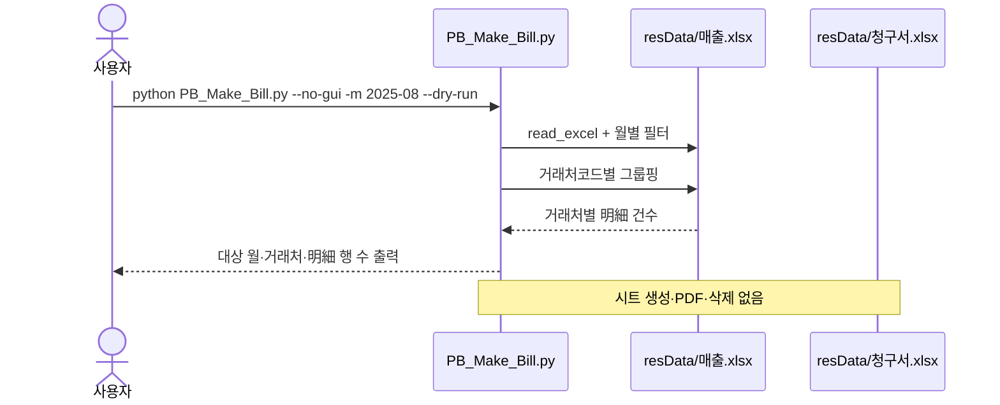
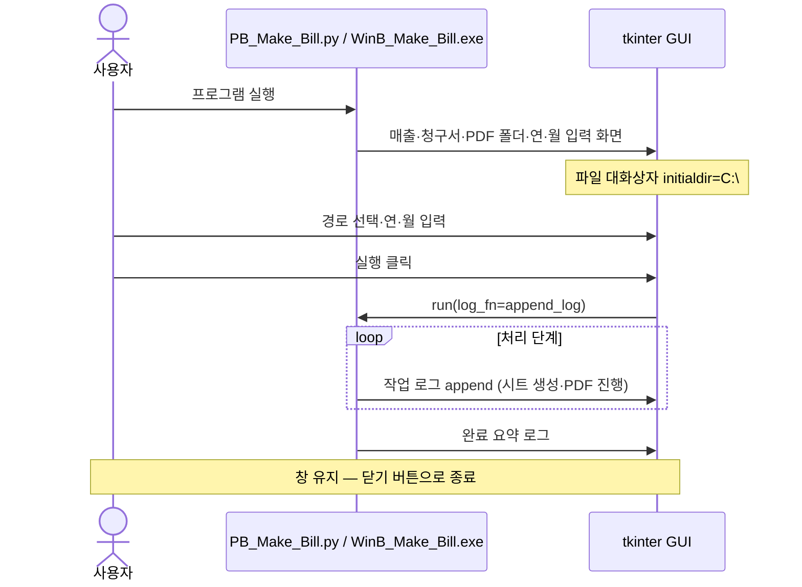
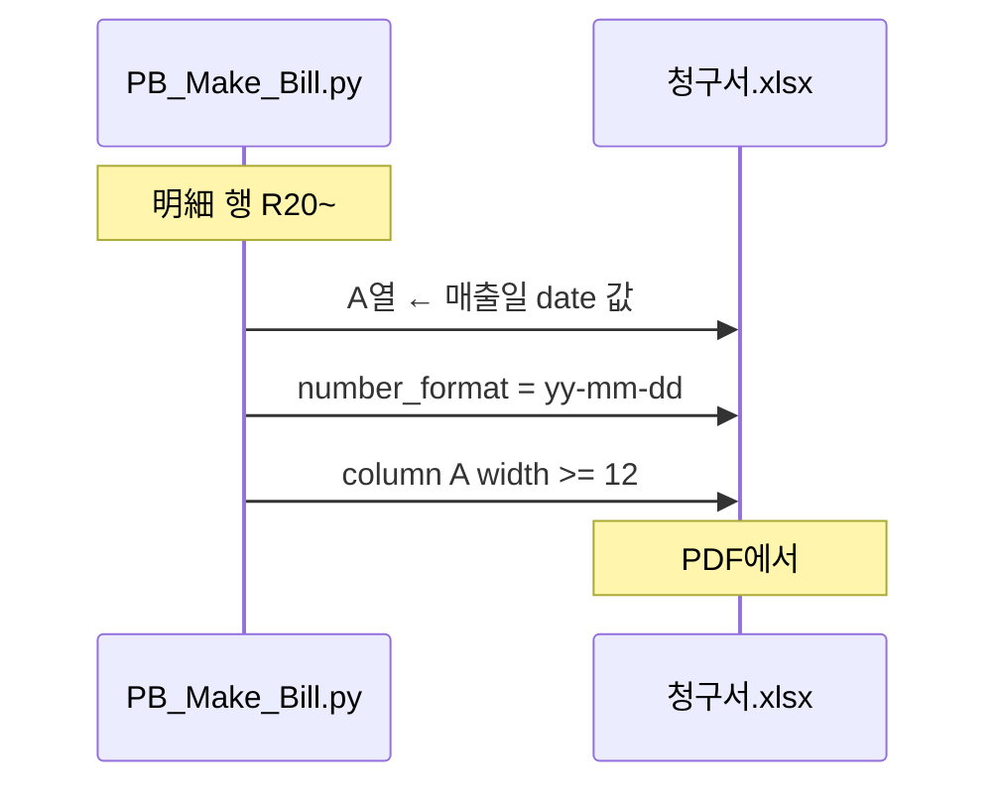
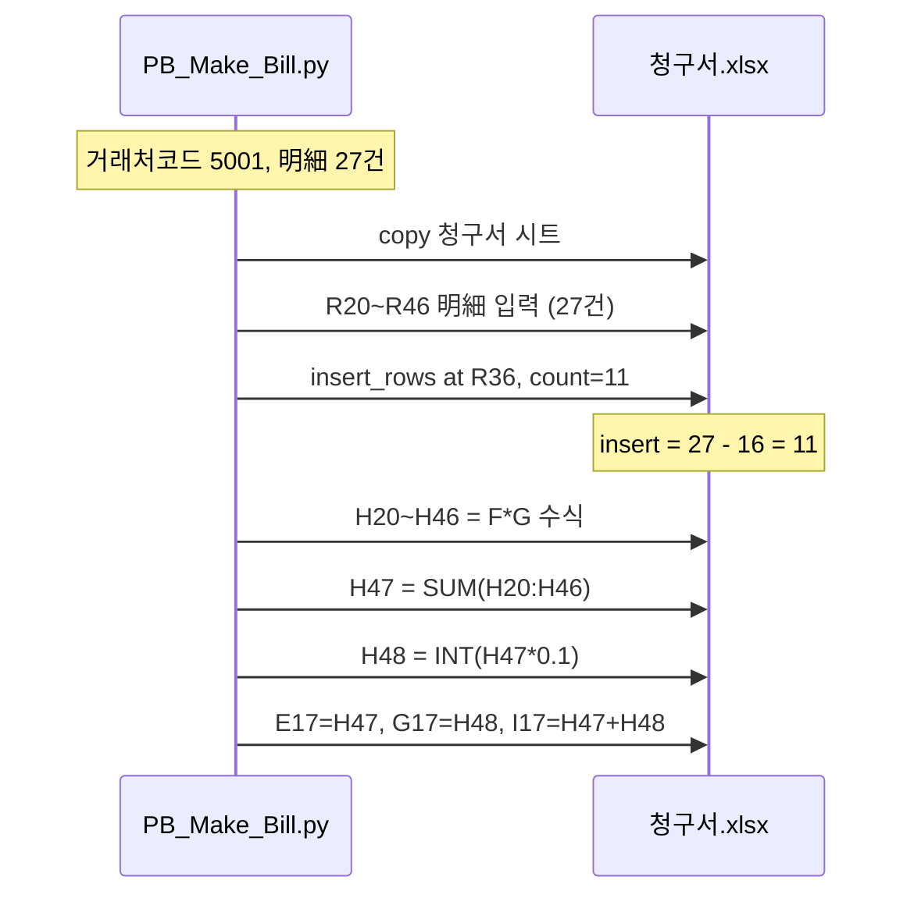
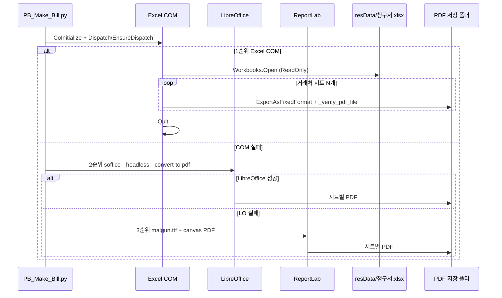
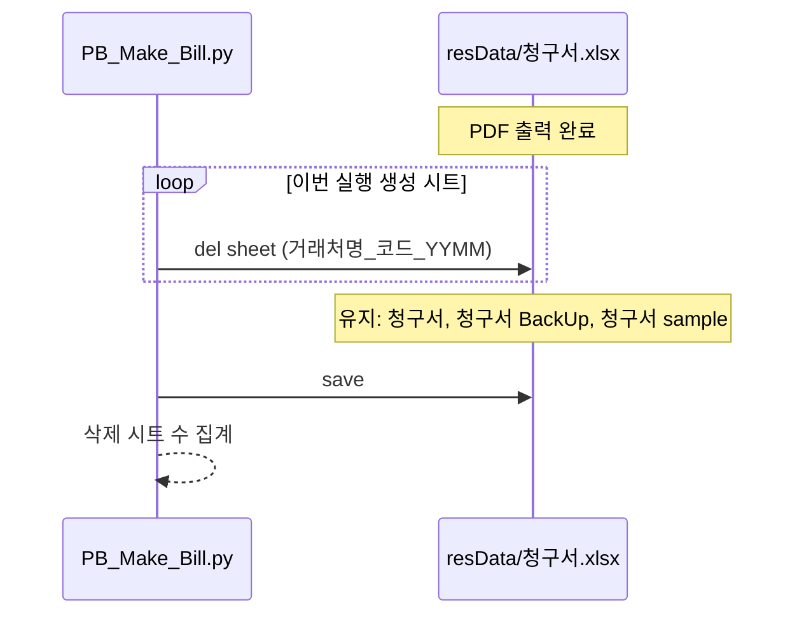
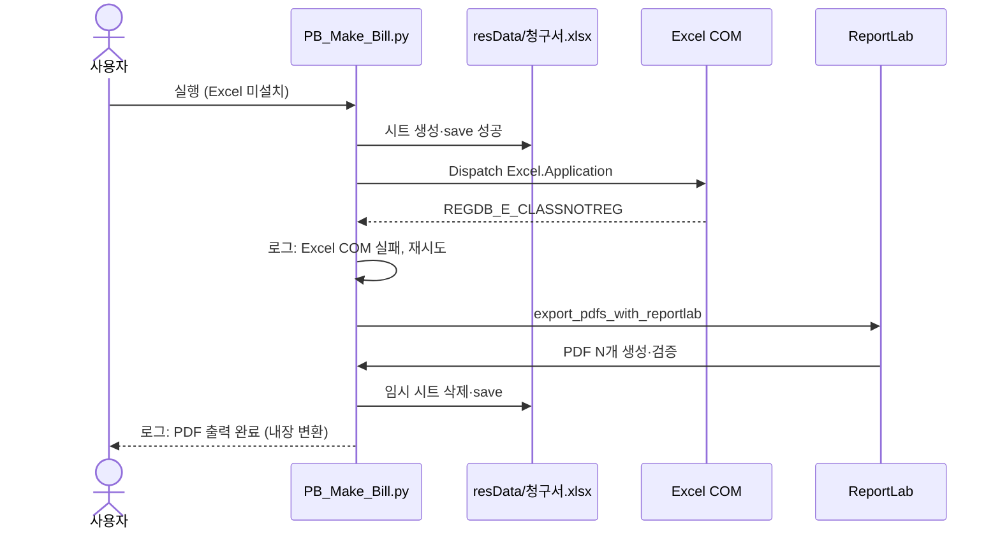
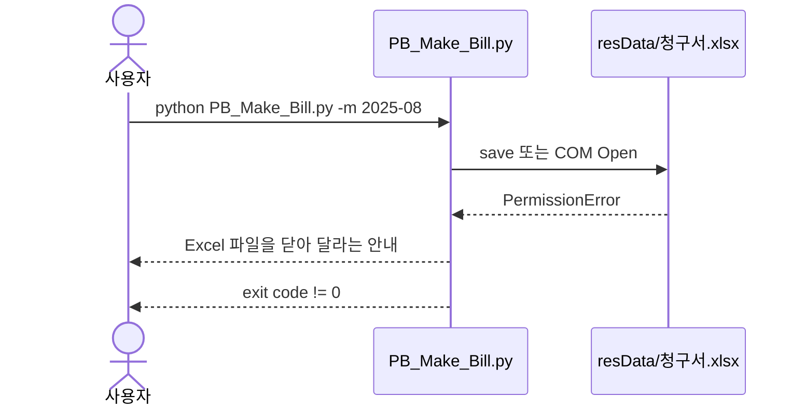
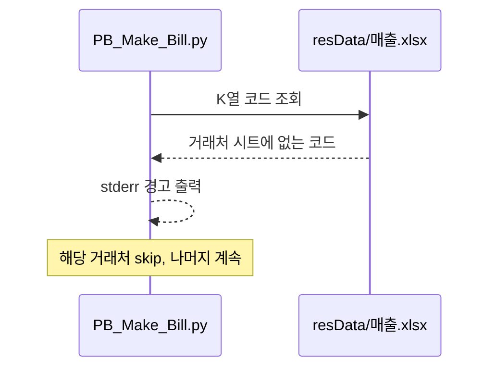

# B03 거래처별 청구서·PDF 생성 Sequence Chart

기준 사양: [B01Bill.md](B01Bill.md)

## 개요

사용자, CLI 프로그램, Excel 파일, Excel COM 간의 상호작용 순서를 나타낸다.

## 정상 실행 시퀀스

## dry-run 실행 시퀀스

## GUI 실행 시퀀스

## 明細 날짜 서식 적용 시퀀스

## 明細 16행 초과 시퀀스

## PDF 출력 시퀀스 (3단계 fallback)

## PDF 후 시트 삭제 시퀀스

## 오류 처리 시퀀스

### Excel COM 실패 → fallback 성공

### Excel 파일 잠금

### 거래처코드 미매칭

## 참여자 설명

| 참여자 | 설명 |
|--------|------|
| 사용자 | GUI 또는 CLI 실행 및 결과 확인 |
| PB_Make_Bill.py / WinB_Make_Bill.exe | 매출 추출, 시트 생성, PDF 3단계 fallback, 시트 삭제, GUI 로그 |
| resData/매출.xlsx | 매출·거래처 시트 (읽기) |
| resData/청구서.xlsx | 청구서 템플릿 복사·임시 시트·저장 |
| resData/PDF (또는 GUI 지정 폴더) | PDF 출력 폴더 |
| Excel COM | 1순위 PDF (`ExportAsFixedFormat`) |
| LibreOffice | 2순위 PDF (`soffice --headless`) |
| ReportLab | 3순위 내장 PDF (Excel/LO 없을 때) |
